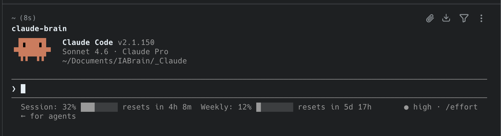

# claude-usage-statusline

Monitor your Claude Pro session and weekly usage directly inside Claude Code's terminal status line — no browser extension needed.



The status line shows:
- **Session** usage (5-hour window) with a progress bar and reset countdown
- **Weekly** usage (7-day window) with a progress bar and reset countdown

```
Session: 32% ███░░░░░ resets in 4h 8m  Weekly: 12% █░░░░░░░ resets in 5d 17h
```

---

## Requirements

- macOS
- [Claude Desktop](https://claude.ai/download) installed and logged in
- [Claude Code CLI](https://claude.ai/code) installed
- Python 3 (`python3 --version`)

---

## Install (one command)

```bash
git clone https://github.com/YOUR_USERNAME/claude-usage-statusline.git
cd claude-usage-statusline
bash install.sh
```

The installer will:
1. Check prerequisites (macOS, Python 3, Claude Desktop)
2. Install the `cryptography` Python package if missing
3. Copy the script to `~/.claude/scripts/claude_usage.py`
4. Run a smoke test
5. Update `~/.claude/settings.json` with the status line configuration

Then **restart Claude Code** — the usage counter will appear in the status line.

> **Keychain prompt:** The first time the script runs, macOS will ask for permission to read Claude Desktop's stored key. Click **"Always Allow"** so it never asks again.

---

## How it works

Claude Desktop stores your session cookies in a local SQLite database (`~/Library/Application Support/Claude/Cookies`), encrypted with AES-128-CBC. The encryption key is derived from a password stored in your macOS Keychain under "Claude Safe Storage".

The script:
1. Reads the AES key from Keychain via the `security` CLI
2. Decrypts the session cookies
3. Calls `https://claude.ai/api/organizations/{org}/usage` using those cookies
4. Formats the response and prints it to stdout for Claude Code's status line

Results are cached for 60 seconds in `/tmp/claude_usage_cache.json` so the API is called at most once per minute, regardless of how often the status line refreshes.

The org ID is **auto-discovered** on the first run (no hardcoded IDs).

---

## Manual install (without the installer)

```bash
# 1. Copy the script
mkdir -p ~/.claude/scripts
cp claude_usage.py ~/.claude/scripts/

# 2. Install dependency
pip3 install cryptography

# 3. Add to ~/.claude/settings.json
```

In `~/.claude/settings.json`, add the `statusLine` field:

```json
{
  "statusLine": {
    "type": "command",
    "command": "python3 /Users/YOUR_USERNAME/.claude/scripts/claude_usage.py",
    "refreshInterval": 60
  }
}
```

---

## Uninstall

```bash
rm ~/.claude/scripts/claude_usage.py
rm /tmp/claude_usage_cache.json
```

Then remove the `"statusLine"` key from `~/.claude/settings.json`.

---

## Troubleshooting

**Status line shows nothing**
- Make sure Claude Desktop is installed and you are logged in at claude.ai
- Run `python3 ~/.claude/scripts/claude_usage.py` manually to see any errors

**Keychain prompt keeps appearing**
- Click **"Always Allow"** (not just "Allow") when prompted

**`ModuleNotFoundError: cryptography`**
- Run `pip3 install cryptography`

---

## Inspiration

Inspired by [claude-counter](https://github.com/she-llac/claude-counter), a browser extension that shows the same metrics as an overlay on claude.ai. This project brings the same information to the Claude Code terminal without requiring a browser extension.

---

## License

MIT
